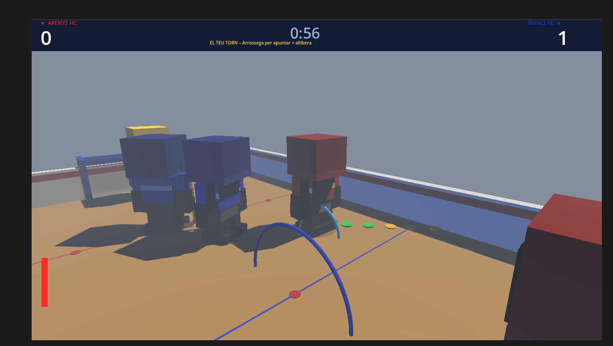

# 🏒 Hoquei Patins 3D

**Alumne:** Pol Hernáez · DAM1 · Escola Pia de Mataró · Curs 2025–26  
**Assignatura:** Entorns de Desenvolupament  
**Motor:** Godot Engine 4.6.2 · GDScript  

---

## Descripció breu

Microvideojoc d'hoquei sobre patins per torns en 3D. Controles el davanter de l'**Arenys HC** (equip vermell) i has de marcar més gols que els **Rivals FC** (equip blau) en 2 minuts. Inspirat en Mini Soccer Star, amb mecàniques de drag per apuntar, 3 tipus de xut, porter intel·ligent i IA amb personalitats aleatòries.

---

## 📸 Captura del joc



---

## 🎮 Vídeo de gameplay

▶️ [Veure vídeo de gameplay comentat (Google Drive)](https://drive.google.com/file/d/1u_jYExgZyAJZAujAlaGHbA701ZHP1hiF/view?usp=drive_link)

---

## 🛠️ Tecnologies utilitzades

- **Llenguatge:** GDScript 4.6
- **Motor:** Godot Engine 4.6.2
- **IDE:** Godot Editor (editor integrat)
- **Eines d'IA:** Claude (Anthropic) — vibe coding 100% amb IA
- **Control de versions:** Git + GitHub
- **Eines de modelatge:** PlantUML (diagrames UML)

---

## ▶️ Com executar el projecte

1. Descarrega **Godot Engine 4.6.2** des de [godotengine.org](https://godotengine.org/download)
2. Clona el repositori:
```bash
git clone https://github.com/PolHernaez/hoquei-patins-joc.git
```
3. Obre Godot → **Importar Projecte** → selecciona la carpeta `fase3/`
4. Prem **F5** per executar

---

## 🕹️ Com jugar

| Acció | Control |
|-------|---------|
| Apuntar i xutar | Arrossegar ratolí + alliberar |
| Moure jugador | Clic a la pista |
| Moure (teclat) | A / D / S / F |
| Tipus de xut | Q = Normal · W = Efecte · E = Fort |
| Passar | P |
| Rewind (desfer xut) | R — màxim 3 usos |
| Rotar càmera | ← → |
| Pausar | ESC |

---

## 📁 Estructura del repositori

```
hoquei-patins-joc/
├── README.md
├── fase1/          → 01_idea_i_abast.md
├── fase2/          → 02_model_del_joc.md + diagrames UML
├── fase3/          → Codi Godot (Main.gd, Main.tscn, project.godot)
│                     + 03_entorn_i_prototip.md + captures
├── fase4/          → 04_proves_i_depuracio.md
└── fase5/          → 05_millores.md + 06_manual_usuari.md
                      + 07_manual_tecnic.md
```

---

## 📊 Estat del projecte

**Versió final** — 19 millores professionals implementades:
porter intel·ligent amb predicció de trajectòria, stamina del jugador, menú de pausa, sistema GK que agafa la pilota, disc indicador de destí, confusió temporal de la IA, invulnerabilitat de possessió, 3 tipus de xut, REWIND, trail de pilota, camera shake, i moltes més.

---

## 👤 Autor

**Pol Hernáez** — DAM1, Escola Pia de Mataró

---

## 💭 Reflexió breu

Aquest projecte m'ha ensenyat que fer un videojoc és molt més que programar: cal pensar en l'experiència de l'usuari, equilibrar la dificultat, detectar bugs que surten de la interacció entre sistemes, i documentar les decisions. El canvi de JavaFX a Godot va ser la decisió més important i correcta del projecte.
