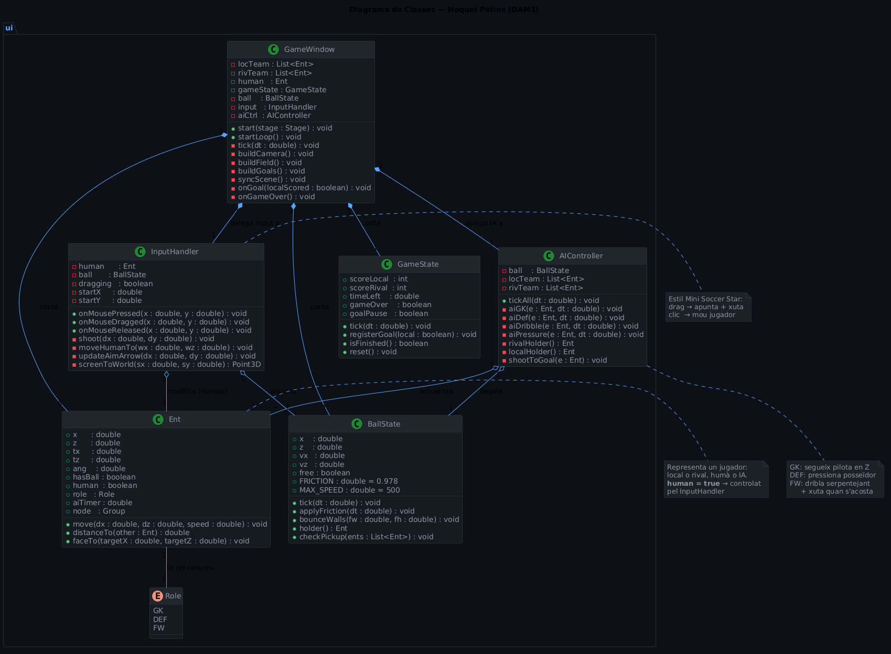
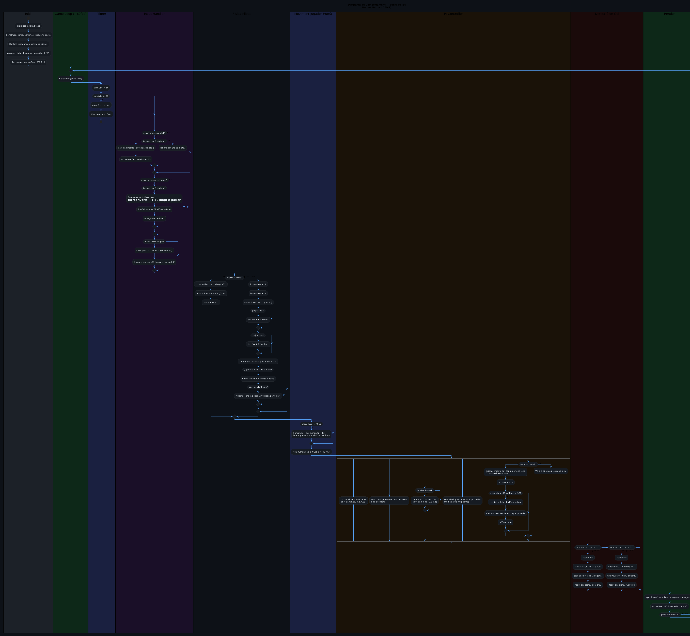

# Diagrames del Joc — Hoquei Patins (DAM1)

**Autor:** Pol Hernáez  
**Mòdul:** Entorns de Desenvolupament  
**Curs:** DAM1 · Escola Pia de Mataró

---

## 1. Diagrama de Classes

El diagrama mostra les **6 classes principals** del joc i les seves relacions:

| Classe | Responsabilitat |
|--------|----------------|
| `GameWindow` | Classe principal JavaFX. Orquestra totes les altres. |
| `Ent` | Representa un jugador (local o rival, humà o IA). |
| `BallState` | Física de la pilota: posició, velocitat, fricció, rebots. |
| `GameState` | Estat del partit: marcador, temps, pauses. |
| `AIController` | Lògica IA per a GK, DEF i FW rivals (i companys). |
| `InputHandler` | Gestiona l'input del ratolí (drag → xut, clic → moure). |

**Relacions:**
- `GameWindow` **compon** (`*--`) totes les classes: és el punt d'entrada i les crea.
- `AIController` i `InputHandler` **associen** (`o--`) `BallState` i `Ent` (les llegeixen/modifiquen però no les posseeixen).
- `Ent` té un **enum** `Role` (GK / DEF / FW).



---

## 2. Diagrama de Comportament (Activitat)

El diagrama mostra el **bucle principal del joc** (~60 fps) dividit en lanes per subsistema:

```
Inici → Timer → Input Handler → Física Pilota →
Moviment Humà → IA Controller → Detecció Gol → Render → (repetir)
```

**Decisions clau al bucle:**

- **Timer:** si `timeLeft ≤ 0` → fi de partida.
- **Input:** si drag → mostra fletxa d'aim i calcula potència; si clic → mou jugador.
- **Física pilota:** si algú la té → pilota va davant del jugador; si és lliure → aplica fricció + rebots + comprova recollida.
- **IA:** cada rol té comportament diferent (GK segueix pilota en Z, DEF pressiona, FW dribla i xuta).
- **Gol:** si `bx < -FW/2` o `bx > FW/2` i dins la porteria → gol, pausa 2s, reset.



---

## 3. Decisions de disseny destacades

### Patró de controls (estil Mini Soccer Star)
> **Drag del ratolí = apunta i xuta** (la longitud del drag determina la potència).  
> **Clic simple = mou el teu jugador** al punt del terra.  
> El jugador s'apropa sol a la pilota quan és lliure (com al Mini Soccer Star mòbil).

### Un sol jugador controlat
L'usuari controla **únicament el FW local** (marcat amb ★ groc). Tots els altres jugadors (GK local, DEF local, i tot l'equip rival) els gestiona `AIController`. Això simplifica els controls i fa el joc més natural.

### Física de la pilota
La pilota segueix la fórmula:
```
bx += bvx × dt
bvx *= FRIC^(dt×60)    // FRIC = 0.978
```
Els rebots a les bandes apliquen coeficient 0.62 per simular l'absorció de les bandes de roller hockey.
