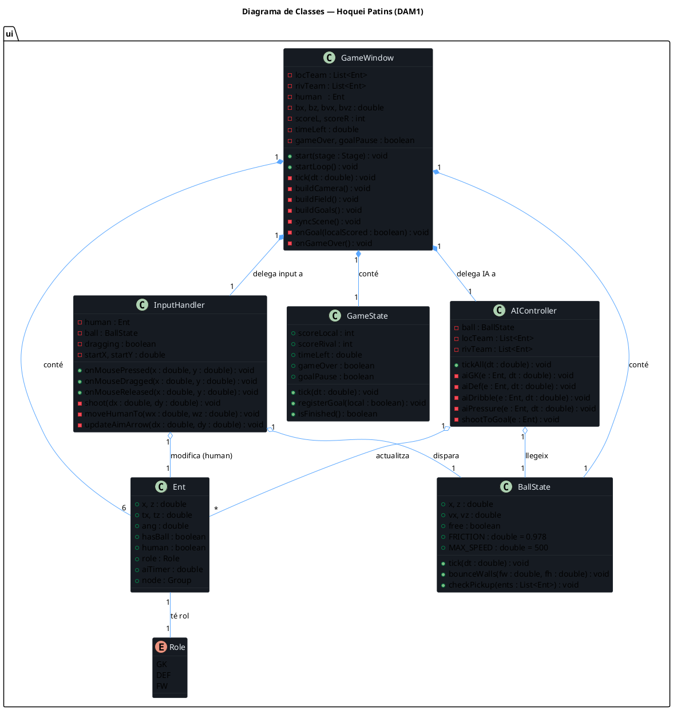
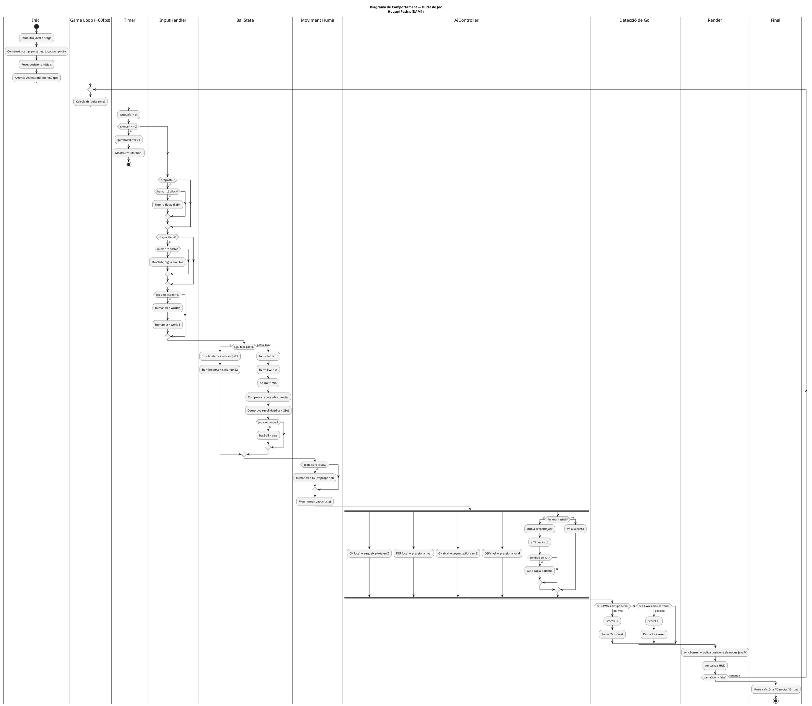

# 02 – Model del Joc

**Alumne:** Pol Hernáez  
**Fase:** 2 – Disseny abans de programar (modelatge)

---

## 1. Components del joc

### Entitats identificades

| Entitat | Rol al joc |
|---------|-----------|
| `Jugador` | Representa un jugador amb nom, energia i habilitat |
| `Equip` | Conté un jugador representatiu i acumula gols |
| `Partit` | Gestiona l'estat global: torns, períodes, possessió i equips |
| `AccioJoc` | Enum amb totes les accions possibles (atac i defensa) |
| `IAController` | Decideix les accions de l'equip rival |
| `GamePanel` | Interfície gràfica Swing (JPanel) que mostra i actualitza l'estat |

### Dades clau (atributs principals)

**Jugador:**
- `nom`: identificador del jugador
- `energia` (0–100): afecta l'efectivitat de les accions; disminueix amb accions potents
- `habilitat` (1–10): multiplicador base per als càlculs de probabilitat

**Equip:**
- `nom`: nom de l'equip (ex: "Arenys HC")
- `gols`: marcador del partit

**Partit:**
- `equipLocal`, `equipVisitant`: els dos equips
- `torn`: torn actual (1–20)
- `periode`: període actual (1 o 2)
- `possessio`: "local" o "visitant", indica qui té la pilota

### Accions (mètodes principals)

- `Jugador.recuperarEnergia()`: incrementa energia entre torns
- `Equip.afegirGol()`: suma un gol al marcador
- `Partit.siguientTorn()`: avança el torn i comprova canvi de període
- `Partit.haAcabat()`: retorna true si s'han completat els 20 torns
- `IAController.decideixAccio()`: retorna una AccioJoc basada en l'estat del Partit
- `GamePanel.actualitzarUI()`: redibuja l'estat a la finestra Swing
- `GamePanel.mostrarResultat()`: mostra el resultat final del partit

---

## 2. Diagrama de classes


### Explicació del diagrama

El diagrama mostra 6 classes amb les seves relacions:

**Associació (línia sòlida):**
- `Equip` → `Jugador`: cada equip té un jugador representatiu (1:1).
- `Partit` → `Equip` (×2): el Partit conté l'equip local i el visitant.

**Dependència (línia discontínua):**
- `GamePanel` → `Partit`: el panell llegeix i mostra l'estat del Partit.
- `GamePanel` → `IAController`: el panell crida la IA per obtenir l'acció rival.
- `IAController` → `AccioJoc`: la IA retorna un valor del enum AccioJoc.

### Com es reflectirà al codi

- `Jugador` serà una classe Java amb camps `int` i mètodes simples.
- `Equip` tindrà un atribut de tipus `Jugador` (composició).
- `Partit` tindrà dos atributs de tipus `Equip` i gestionarà tota la lògica de torns.
- `AccioJoc` serà un `enum` Java amb 5 valors.
- `IAController` serà una classe separada amb un mètode estàtic o d'instància.
- `GamePanel` serà un `JPanel` que farà de vista (MVC bàsic).

---

## 3. Diagrama de comportament (activitat)


### Explicació del diagrama

El diagrama d'activitat representa el **bucle principal del joc** (game loop):

1. **Iniciar Partit**: es creen els dos equips i es configuren els paràmetres inicials.
2. **Mostra estat**: la UI actualitza marcador, torn, període i energia.
3. **Tria acció**: si l'equip local té possessió, el jugador tria via botons Swing; sinó, la IA decideix i el jugador tria la defensa.
4. **Calcula resultat**: s'aplica la fórmula de probabilitat basada en habilitat i energia.
5. **Actualitza gols i possessió**: es modifica l'estat del `Partit`.
6. **Fi del joc?**: si `torn == 20`, s'acaba el partit i es mostra el resultat final.
7. **Bucle (No)**: si no ha acabat, es torna al pas 2 (fletxa discontínua de retorn).

### Com es reflecteix al joc

El bucle es materialitza com un flux d'esdeveniments Swing: cada cop que el jugador prem un botó, el `GamePanel` crida la lògica del `Partit`, obté el resultat, i crida `actualitzarUI()` per refrescar la pantalla. No hi ha cap `while` explícit; el flux el controla l'event listener de Swing.

---

## 4. Estructura del repositori

```
hoquei-patins-joc/
├── README.md
├── src/
│   ├── model/
│   │   ├── Jugador.java
│   │   ├── Equip.java
│   │   ├── Partit.java
│   │   └── AccioJoc.java
│   ├── logic/
│   │   └── IAController.java
│   └── ui/
│       ├── GameWindow.java
│       └── GamePanel.java
├── diagrames/
│   ├── diagrama_classes.svg
│   └── diagrama_comportament.svg
├── docs/
│   ├── 01_idea_i_abast.md
│   ├── 02_model_del_joc.md
│   ├── 03_entorn_i_prototip.md
│   ├── 04_proves_i_depuracio.md
│   ├── 05_millores_i_reflexio_final.md
│   └── IA_log.md
└── .gitignore
```

---

## 5. Repositori inicial – primer commit

El primer commit inclou:
- Estructura de carpetes creada
- README.md amb descripció del projecte
- Diagrames UML afegits a `/diagrames`
- Aquest document com a primera documentació formal

**Missatge del primer commit:** `init: estructura del projecte i diagrames UML`

---

## 10. Codi UML (PlantUML)

Els diagrames s'han generat amb **PlantUML** (eina equivalent a UMLTree). El codi font es pot enganxar a [plantuml.com](https://www.plantuml.com/plantuml/uml/) per regenerar les imatges.

### Diagrama de Classes



### Diagrama de Comportament (Activitat)



