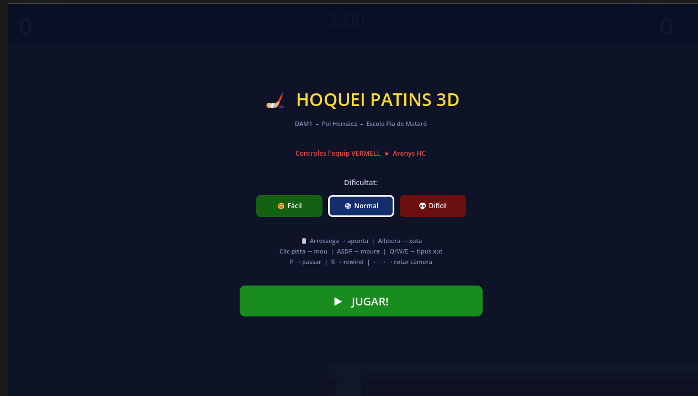
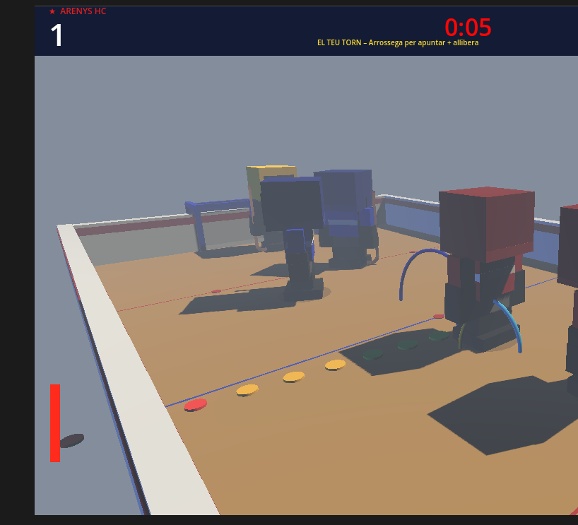
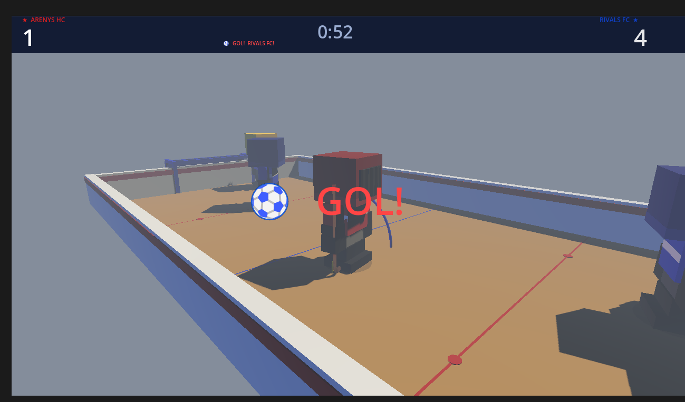
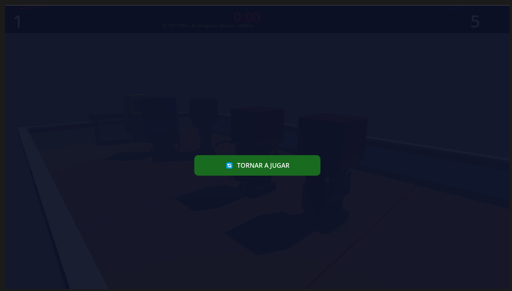

# 03 – Entorn i Prototip

**Alumne:** Pol Hernáez  
**Mòdul:** Entorns de Desenvolupament  
**Curs:** DAM1 – Escola Pia de Mataró  
**Projecte:** Hoquei Patins 3D  

---

## 1. IDE i motor de joc utilitzats

**Motor:** Godot Engine 4.6.2 (stable, oficial)  
**IDE addicional:** Visual Studio Code (edició de GDScript i documentació)  
**SO:** Windows 11  
**Ruta projecte Godot:** `C:\Users\Pol\Documents\Entorns\hoquei-patins-godot\`  
**Repo GitHub:** https://github.com/PolHernaez/hoquei-patins-joc

### Per què Godot i no JavaFX?

El projecte va iniciar-se amb **JavaFX 3D**, però es va detectar que:
- JavaFX no és un motor de jocs → no té físiques, gestió de càmera, ni renderer integrats
- Els bugs de coordenades 3D eren impossibles de corregir sense un motor real
- El resultat visual era molt per sota del que requereix el projecte

Es va migrar a **Godot 4.6**, que ofereix:
- Renderer 3D professional amb ombres i llums
- GDScript tipat, molt llegible i similar a Python
- Zero dependències externes (un sol `.exe` per executar)
- Exportació a Windows, HTML5, Android

### Configuració del projecte (`project.godot`)

```ini
config_version=5

[application]
config/name="Hoquei Patins"
run/main_scene="res://Main.tscn"
config/features=PackedStringArray("4.2")

[rendering]
renderer/rendering_method="forward_plus"
```

---

## 2. Decisions inicials d'implementació

### Arquitectura

Tot el joc està en **un sol script GDScript** (`Main.gd`, ~1.200 línies) que construeix tots els elements 3D de forma procedural. Aquesta decisió garanteix:
- Distribució en 3 fitxers (sense assets externs obligatoris)
- Control total sobre geometria, materials i llums
- Facilitat de modificació i depuració

### Taula de decisions clau

| Decisió | Raó |
|---------|-----|
| **Geometria procedural** | Jugadors, camp i porteries es construeixen amb `BoxMesh`, `SphereMesh`, `CylinderMesh`, `TorusMesh` en codi |
| **Física manual** | Control precís sobre fricció (FRIC=0.991), rebots i corba de pilota |
| **GDScript tipat explícit** | Godot 4.6 és estricte amb arrays genèrics → `float(array[i])` en totes les operacions |
| **Càmera 3a persona** | Segueix el jugador humà (★) des de darrere, com Mini Soccer Star |
| **Discs plans per a la fletxa** | Visibles des de qualsevol angle de càmera inclinada (cilindres `height=0.10`) |
| **Torn-based pur** | Quan és el teu torn, els rivals queden gairebé quiets (com MSS) |

### Mecànica de joc (inspiració Mini Soccer Star)

| Element MSS | Implementació |
|-------------|---------------|
| Temps aturat al teu torn | `phase == Phase.MY_TURN` atura tots els rivals |
| Drag per apuntar | `InputEventMouseMotion` amb drag > 8px |
| Alliberar = xuta | `InputEventMouseButton` released detecta fi de drag |
| 3 tipus de xut | Normal (32 u/s), Efecte/corba (24 u/s), Fort (50 u/s) |
| Rewind | 3 usos per partida, restaura estat anterior |

---

## 3. Prototip funcional – Funcionalitats implementades

### Sistema de joc complet

- [x] Menú inicial amb selecció de dificultat (Fàcil / Normal / Difícil)
- [x] Camp de parquet 3D amb línies, cercle central i punts de cara-off
- [x] Porteries vermella (local) i blava (rival) amb xarxa semitransparent
- [x] Bandes blanques amb franja vermella (roller hockey)
- [x] 3 jugadors per equip: GK (porter), DEF i FW (davanter, control humà)
- [x] Jugadors blocky Roblox-style: patins amb 8 rodes vermelles, casc amb reixa, estic de fusta/GLB
- [x] Pilota taronja amb física (fricció, rebots a bandes, efecte de corba visual)
- [x] Sistema de torns: torns alternats entre humà i IA
- [x] Fletxa d'apuntament amb discs de colors (verd→groc→vermell = potència)
- [x] 3 tipus de xut: Normal, Efecte (corba lateral visible), Fort
- [x] Passa al company (vol visible amb arc en Y)
- [x] REWIND: desfà l'últim xut (3 usos)
- [x] HUD: marcador, rellotge 2 minuts, barra de potència
- [x] Pantalla de resultat (Victòria / Derrota / Empat) amb botó reiniciar
- [x] Rotar càmera amb ← → (orbit al voltant del camp)

### 12 Millores Professionals Implementades

| # | Millora | Descripció |
|---|---------|------------|
| 1 | **Dive del porter** | El GK es llança cap a la cantonada prevista. 30% probabilitat d'error (dificultat Normal) |
| 2 | **Rotació de jugadors** | Tots els jugadors giren suaument per mirar on es mouen |
| 3 | **IA estratègica** | Si van perdent als últims 45s, la IA ataca 40% més ràpid |
| 4 | **Camera shake** | Tremolor de càmera 1.5s quan hi ha gol |
| 5 | **Trail de la pilota** | Rastre de 8 esferes que s'esvaeixen quan la pilota va ràpida |
| 6 | **Advertència 30s** | El rellotge es torna vermell parpellejant als últims 30 segons |
| 7 | **Dificultat** | Fàcil / Normal / Difícil ajusten velocitat i precisió del GK |
| 8 | **Arc de passa** | La pilota fa un arc vertical quan passes (sembla una passa real) |
| 9 | **Text GOL! animat** | Text "⚽ GOL!" apareix al centre amb animació elàstica |
| 10 | **Corba visible** | L'efecte corba té força 12.0 → trajectòria molt visible en pantalla |
| 11 | **Personalitat de la IA** | Cada partida la IA és aleatòriament agressiva, equilibrada o defensiva |
| 12 | **Xarxa semitransparent** | La xarxa de la porteria és transparent (no sembla una paret sòlida) |

### Com executar el joc

1. Descarregar **Godot Engine 4.6** de [godotengine.org](https://godotengine.org)
2. Obrir Godot → "Importar Proyecto Existente" → seleccionar `project.godot`
3. Prémer **F5** per executar

---
## 4. Captures de pantalla

**Captura 1 – Menú inicial amb selecció de dificultat**


**Captura 2 – Joc en marxa: camp, jugadors i fletxa d'apuntament**


**Captura 3 – Advertència últims 30 segons (rellotge vermell)**


**Captura 4 – Text GOL! animat al centre de la pantalla**


**Captura 5 – Pantalla de resultat final**


## 5. Control de versions – Historial de commits

| Commit | Descripció |
|--------|------------|
| `init` | Estructura inicial del projecte, carpetes i gitignore |
| `feat: JavaFX prototip inicial` | Primera versió amb camp i porteries |
| `refactor: migració a Godot 4.6` | Tot el joc reescrit en GDScript |
| `feat: gameplay funcional` | Main.gd complet amb física, IA i HUD |
| `docs: fase3 i fase5 actualitzats amb Godot` | Documentació actualitzada |
| `feat: 12 millores professionals` | Dive GK, trail, dificultat, camera shake, rotació jugadors |

---

## 6. Controls del joc

| Acció | Control |
|-------|---------|
| Apuntar | Arrossega el ratolí |
| Xutar | Allibera el ratolí |
| Moure jugador | Clic a la pista / ASDF |
| Tipus de xut | Q (Normal) / W (Efecte) / E (Fort) |
| Passar | P |
| Rewind | R |
| Rotar càmera | ← → (fletxes) |
| Reset càmera | ↑ |

---

## 7. Fitxers del projecte

```
fase3/
├── Main.gd          ← Script principal (~1.200 línies, tot el joc)
├── Main.tscn        ← Escena Godot (referència al script)
├── project.godot    ← Configuració del motor
└── stick.glb        ← Model 3D de l'estic (opcional, fallback procedural)
```
